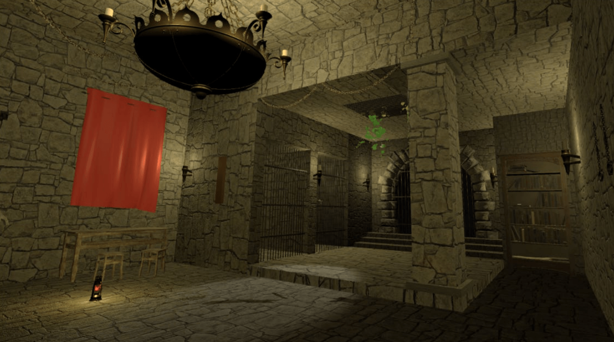
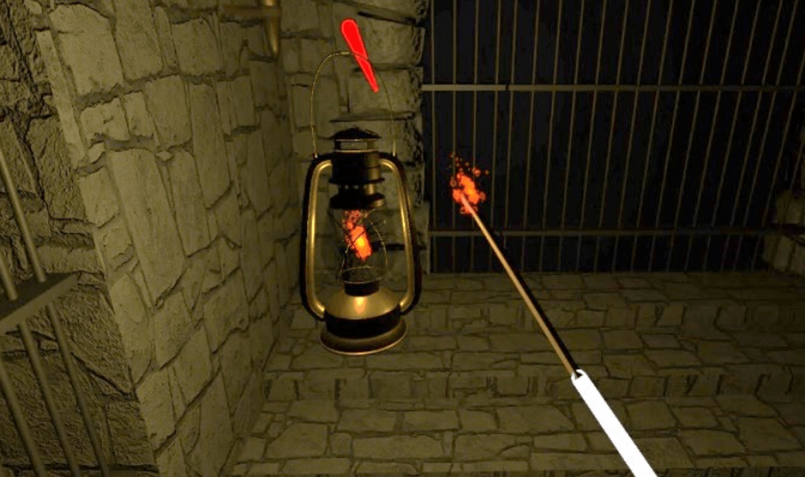
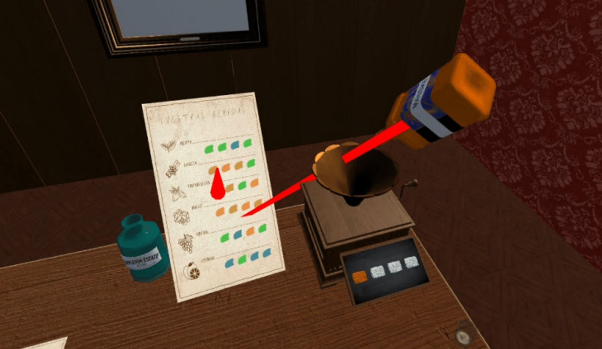
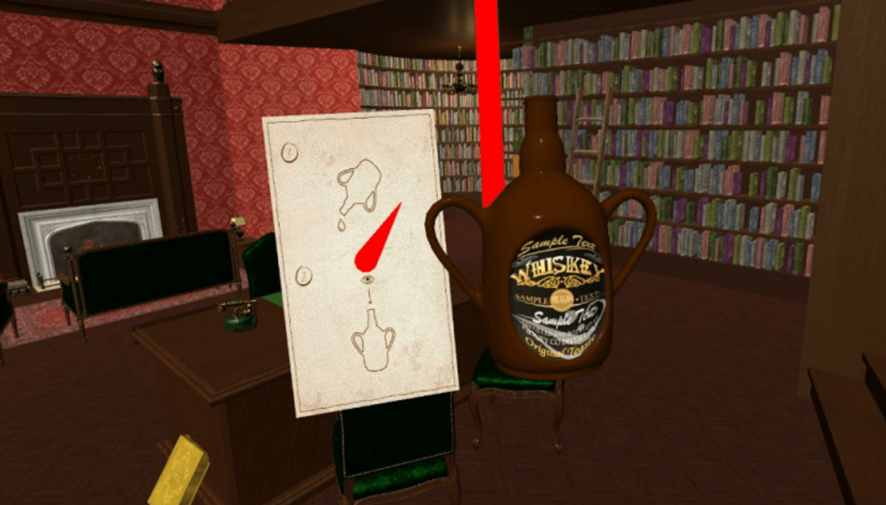
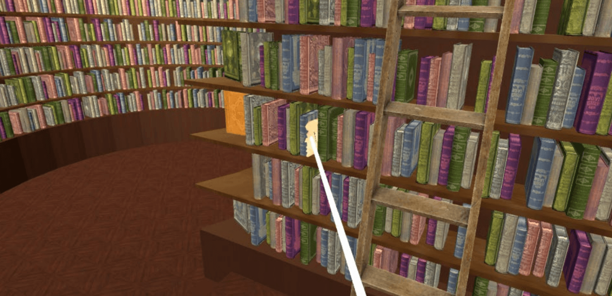

# Easton Royal — VR Escape Room

<p align="center">
  
</p>

A first-person VR escape room for **Oculus Quest** set in Victorian England. The player wakes up amnesiac and imprisoned in a dungeon, and must solve a chain of interconnected puzzles across two hand-crafted environments to uncover the truth behind their captivity.

> Published on [SideQuest](https://sidequestvr.com/app/41224/easton-royal) · Built with Unity 2021 · C# · Oculus Quest

---

## Screenshots

<p align="center">
  
  
</p>
<p align="center">
  
  
</p>

---

## Gameplay

**Genre:** Adventure / Puzzle  
**Platform:** Oculus Quest (standalone VR)  
**Perspective:** First-person, room-scale interaction

Core mechanics:
- Physical object interaction — pick up, place, rotate, and combine objects
- Multi-step puzzle chains with environmental storytelling
- Collectible notes and photographs that reveal the narrative
- Progress tracking across two levels with save/load support

### Environments

**Dungeon** — the starting area. Escape by solving mechanical puzzles:
lock and key, lever-activated lights, rotating cylinders, fire/candle chain reactions.

**Library / Study** — the second level. Solve logic puzzles to uncover the truth:
statue assembly, bottle chemistry, piano, combination chest, corkboard clues.

---

## Architecture

The codebase follows a component-based architecture typical of Unity projects.
Scripts are organized by level and responsibility:

```
EastonRoyal/
├── HUD/
│   ├── MenuController          # VR controller input — toggles inventory, pause, progress menus
│   ├── QuitButton              # Destroys singleton managers and returns to the main menu
│   ├── NotePickup              # Tracks collectible notes; updates HUD icons on pickup
│   ├── MatchSpawner            # Resets and teleports the match to its spawn point
│   ├── CandleHolderSpawner     # Teleports the candelabrum to its spawn point
│   └── CodePhotoSpawner        # Teleports the code-reference photo to its spawn point
│
├── Dungeon/                    # Dungeon puzzles and interactive objects
│   ├── SlidingBlockPuzzle      # Sliding-block sequence puzzle (10 blocks, 15-step solution)
│   ├── PuzzleResetButton       # Reset button — restores all blocks to start positions
│   ├── ChainPull               # Chain pull → staircase animation + zone unlock
│   ├── CandleHolder            # Candelabrum lit by match → enables rotating cylinders
│   ├── DoorLock                # Door lock — opens when the dungeon key collides
│   ├── Match                   # Match collectible
│   ├── CodePhoto               # Code-reference photo collectible
│   ├── LightPanel              # Four rotating photo-frame puzzle → opens bookcase
│   ├── MatchLightWall          # Wall trigger that lights a match on contact
│   └── SpinningCylinders/      # SpinningCylinder, SpinningCylinder2–4 — cylinder pieces
│
├── Library/                    # Library puzzles and interactive objects
│   ├── ChestLock               # Four-digit combination chest lock
│   ├── MainBottle              # Main bottle — detects tilt and pouring angle
│   ├── SecondaryBottle         # Secondary bottle — signals the mixing board
│   ├── NoteDrawer              # Drawer that opens when the correct key collides
│   ├── DeskDrawers             # Desk drawer animation
│   ├── ChestLockPanel          # Toggles the combination-lock UI panel
│   ├── Thumbtack               # Thumbtack placed on corkboard → reveals clue
│   ├── MixingZone              # Collision zone that detects bottles entering it
│   ├── LibraryKeyUnlock        # Activates the library key when note conditions are met
│   ├── StatuePuzzle            # Body-part rotation puzzle (4 active parts)
│   ├── FinalKeyTrigger         # Final key trigger → game complete
│   ├── Piano                   # Piano that plays a random note on interaction
│   └── DrinkBoard              # Drinks corkboard — tracks pour colors, checks win condition
│
└── Core/                       # Game-wide managers and utilities
    ├── GameManager             # HUD timer, level transitions, save-state restore on load
    ├── DataManager             # Player profiles, auto-save, main-menu UI population
    ├── SaveSystem              # JSON file I/O for player persistence
    ├── AudioManager            # Centralized SFX, music, and voiced narration
    ├── SerializableUserData    # Player save model (22 puzzle-completion flags)
    ├── PlayerProfileCard       # UI prefab card for the player-selection screen
    ├── UIManager               # Main menu slider and scene load
    ├── UIXRManager             # XR menu: music track preview and Play button
    ├── Singleton<T>            # MonoBehaviour singleton base class
    ├── VRKeyboardKey           # VR keyboard key-press handler
    ├── VRKeyboard              # VR keyboard visibility toggle and input buffer
    ├── LevelReset              # Reloads the active scene
    ├── SceneExitButton         # Loads the main menu scene
    └── GameConstants           # All numeric constants, scene names, object tags
```

Key design decisions:

| Decision | Rationale |
|----------|-----------|
| Singleton managers | GameManager, DataManager, AudioManager are accessed globally — Singleton ensures a single authoritative instance |
| JSON save files | Replaces the original BinaryFormatter (deprecated in .NET 5); human-readable and forward-compatible |
| One-time narration via HashSet | Voice lines that should only play once are tracked in a HashSet rather than individual boolean flags |
| Interaction cooldown | A shared `_canInteract` flag with a 2-second cooldown prevents accidental double-triggers in VR gloves |

---

## Installation

This repository contains only the C# scripts. The full Unity project (scenes, assets,
prefabs) is not included for size reasons.

Requirements:
- Unity 2021 LTS or later
- Oculus Integration SDK
- XR Plugin Management (OpenXR or Oculus XR Plugin)

1. Open the Unity project
2. Place these scripts under `Assets/Scripts/` preserving the folder structure
3. Build for Android (Oculus Quest target)

---

## License

MIT
